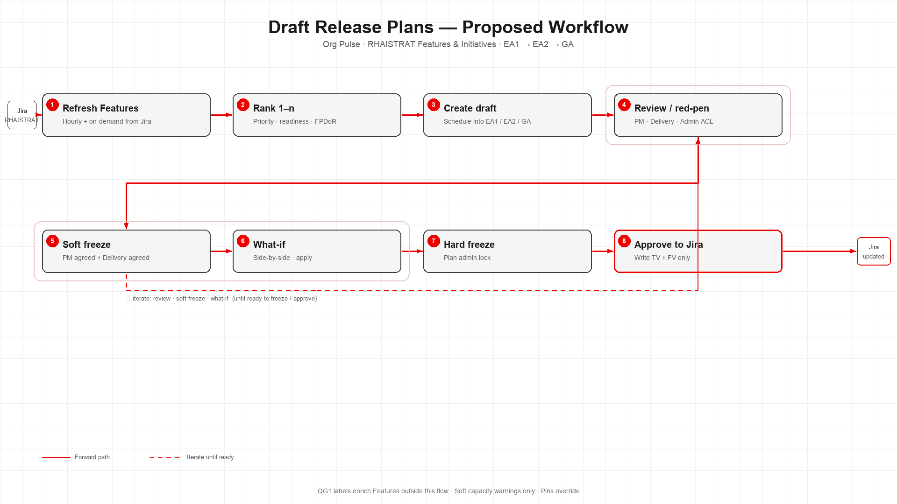

# Release Planner Tool

Onboarding and design home for **RHAI Draft Release Plans**: how we create, review, freeze, and **Approve to Jira** quarterly release plans (EA1 → EA2 → GA) from RHAISTRAT Features and Initiatives.

This repo is documentation and diagrams. Product code lives in:

| Repo | Role |
|------|------|
| [rhai-org-pulse](https://github.com/red-hat-data-services/rhai-org-pulse) | Org Pulse — interactive Create / Draft Plans / Approve to Jira (planned MVP home) |
| [release-planning](https://gitlab.com/) *(GitLab)* | Offline / CI planning support (QG1 labels, optional velocity & reports) — **not** the interactive Create path |

**Owners:** Erle Marion ([@emarion1](https://github.com/emarion1)) · **Collaborators:** John Graham ([@jgraham22](https://github.com/jgraham22))

---

## Start here (new engineer)

Read in this order (~60–90 minutes):

1. **[docs/GLOSSARY.md](./docs/GLOSSARY.md)** — terms used everywhere else  
2. **[docs/ARCHITECTURE-CURRENT-STATE.md](./docs/ARCHITECTURE-CURRENT-STATE.md)** — what exists today (and what’s broken)  
3. **[docs/DRAFT-RELEASE-PLANS-IMPLEMENTATION-PLAN.md](./docs/DRAFT-RELEASE-PLANS-IMPLEMENTATION-PLAN.md)** — locked decisions + phased plan  
4. **[docs/DRAFT-PLANS-DATA-CONTRACT.md](./docs/DRAFT-PLANS-DATA-CONTRACT.md)** — planned draft / edits / Approve shapes  
5. **[docs/DATA-INVENTORY.md](./docs/DATA-INVENTORY.md)** — producers, consumers, storage keys  
6. **Diagrams** below  

Then open the Org Pulse `modules/releases/` code and the Jira epic [AIPCC-19994](https://redhat.atlassian.net/browse/AIPCC-19994).

---

## Diagrams

| File | Audience |
|------|----------|
| [diagrams/draft-release-plans-workflow-high-level.png](./diagrams/draft-release-plans-workflow-high-level.png) | Product / process — Create → iterative review → Approve to Jira |
| [diagrams/draft-release-plans-workflow-data-flow.png](./diagrams/draft-release-plans-workflow-data-flow.png) | Engineering — same flow with artifact edge labels |

---

## Current vs planned (one paragraph)

**Today:** Org Pulse can review/red-pen/freeze a draft *if* a draft JSON is present (often the demo fixture). release-planning CI can rank and schedule Features into reports, but those files are **not** the Draft Plans editor contract. There is no reliable end-to-end Create → load → Approve-to-Jira path.

**Planned:** Org Pulse owns interactive Create, what-if, red-pen, soft/hard freeze, and Approve to Jira (TV+FV). release-planning / agentic-ci remain support (QG1 labels, optional velocity). See the implementation plan.

---

## Jira tracking

| Epic | Purpose |
|------|---------|
| [AIPCC-19994](https://redhat.atlassian.net/browse/AIPCC-19994) | Org Pulse Draft Release Plans (DRP-A0…A12) |
| [AIPCC-19993](https://redhat.atlassian.net/browse/AIPCC-19993) | Support — QG1, velocity, optional offline reports |

---

## Contributing

- Prefer small PRs that keep docs aligned with locked decisions.  
- If a product decision changes, update the implementation plan and glossary in the same PR.  
- Code changes still land in `rhai-org-pulse` / release-planning — link them from here when behavior or contracts change.
