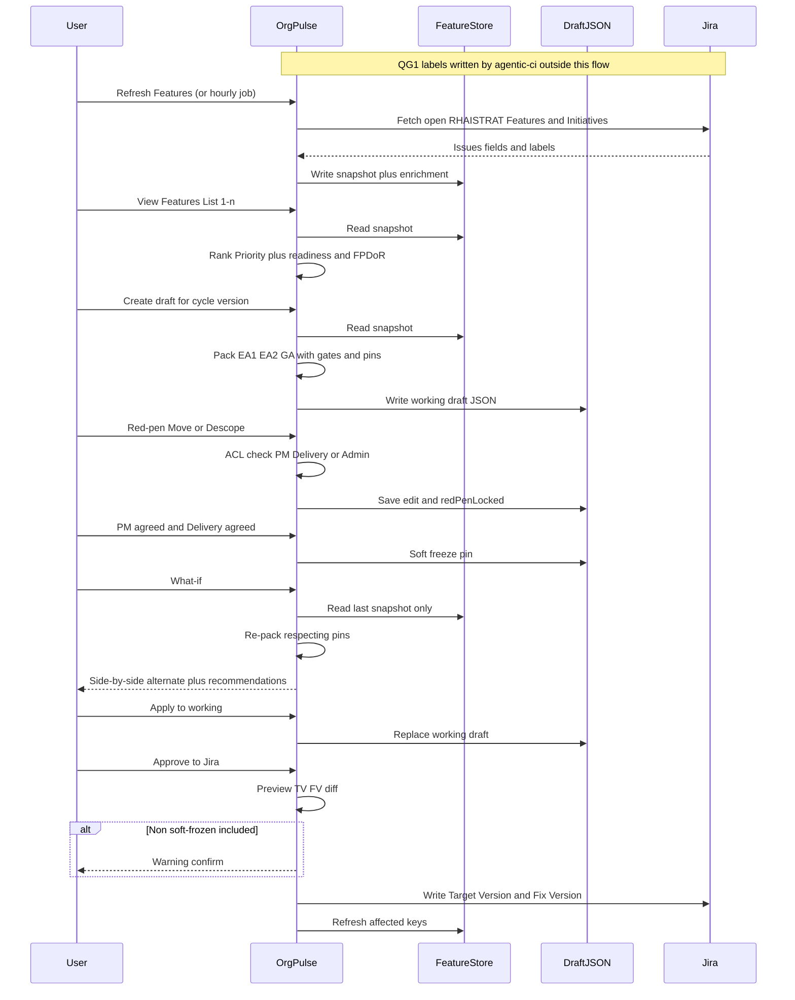

# Draft Release Plans — Implementation Plan

**Status:** Phase 0 complete — ready for Phase 1  
**Updated:** 2026-07-23  
**Goal:** Create draft quarterly release plans (EA1 → EA2 → GA) from RHAISTRAT Features/Initiatives that the organization can review, modify, freeze, and **Approve to Jira**.

**Related:**

- Data contract: [DRAFT-PLANS-DATA-CONTRACT.md](./DRAFT-PLANS-DATA-CONTRACT.md)
- Current-state architecture: [ARCHITECTURE-CURRENT-STATE.md](./ARCHITECTURE-CURRENT-STATE.md)
- Glossary: [GLOSSARY.md](./GLOSSARY.md)
- Data inventory: [DATA-INVENTORY.md](./DATA-INVENTORY.md)
- Source canvas (Cursor): [../assets/draft-plan-architecture-workflow.canvas.tsx](../assets/draft-plan-architecture-workflow.canvas.tsx)

---

## 1. Locked product decisions

These are settled. Do not reopen without an explicit decision.

| Topic | Decision |
|-------|----------|
| Interactive system | Org Pulse owns Create, what-if, review/edit, freeze, and **Approve to Jira** |
| Terminology | Do **not** use “Commit.” Jira placement write = **Approve to Jira**. Row toggles = **PM agreed** / **Delivery agreed** |
| GitLab release-planning | Off the interactive path; optional weekly velocity job and/or offline reports only |
| What-if → GitLab Create | **No** — what-if runs only inside Org Pulse |
| Universe | **All open Features and Initiatives in RHAISTRAT** |
| Product families (v1) | **RHOAI + RHAII** only, from Target Version names on one combined draft |
| Ownership fields | **PM** = Business Owner; **Assignee** = Delivery (Engineering) owner |
| Jira Feature refresh | On-demand + **hourly** background (to start) |
| Velocity / capacity | Weekly component + team p75 ceilings. **Soft warnings only** — never hard-block; soft freeze / red-pen lock overrides capacity for pinned rows |
| Priority (1–n) | One Org Pulse formula: RICE + Big Rock position + Target Version + Jira Priority |
| Big Rock weights | Org Pulse Big Rocks order (only non-Jira ranking input) |
| Create readiness gate | Structural + EA1 admin tiers (see §2) |
| Strat / QG1 / FPDoR | Enrichment; human sign-off FPDoR early pass (§2.4.1); QG1 choice A (agentic-ci writer, OP reads labels) |
| Hard not-ready UX | Cannot schedule into EA1/EA2/GA + reason + Jira readiness recommendations |
| What-if | Side-by-side alternate vs working; explicit apply; last Feature snapshot only |
| Red-pen ACL | PM, Delivery owner, or listed plan Admin only; their edit **locks** placement for daily Create |
| Concurrency | Per-Feature access rules + per-Feature edit lock |
| Soft freeze | **PM agreed** + **Delivery agreed** → pin; default set for Approve to Jira |
| Approve to Jira | Plan Admin; writes **TV + FV**; default soft-frozen only; **Admin may bypass** with confirm + warning; readiness never written |
| Hard freeze | Event / Final GA (plan admin) |
| Create cadence | On-demand; daily auto-Create; **twice daily** in two weeks before planning freeze |
| Cycles in UI | Cycles whose **planning freeze has not passed**, looking ahead **two release cycles** (e.g. 3.6 + 3.7) |
| As-is Jira view | Valuable (TV → EA1/EA2/GA as Jira stands today) — **deferred** to a later phase |
| Draft file | Create writes `releases/draft-plans/drafts/combined/{version}.json` |
| Demo fixture | Not the production path after Create exists |

---

## 1A. Phase 0 decisions (workshop 2026-07-23)

Answers formerly in §5 — now locked:

| # | Topic | Decision |
|---|--------|----------|
| 1 | EA1 admin minimum | **Structurally ready + Target Version** (not draft inclusion). PM/Assignee/RFE/docs not required for EA1 |
| 1b | Human sign-off for EA1 | **Preference** (not required) |
| 1c | QG1 EA1 packing | Ordered tiers: human-sign-off → `rp-qg1-pass` → neither |
| 1d | QG1 agentic-ci | Daily; ops-owned; not Phase 1 blocker |
| 2 | What-if identity | Side-by-side + apply to working |
| 3 | Red-pen stickiness | Authorized red-pen → locked for daily Create |
| 4 | Concurrency | Per-Feature ACL + per-Feature lock |
| 5 | What-if refresh | Last snapshot only |
| 6 | Approve to Jira | TV + FV; plan Admin; soft-freeze default; Admin bypass w/ confirm + warning |
| 7 | Readiness vs Approve | Placement only |
| 8 | Universe | All open RHAISTRAT Features + Initiatives |
| 9 | Multi-product | Combined draft; RHOAI + RHAII via TV names |
| 10 | Background refresh | **Hourly** |
| 11 | Near-freeze Create | **Twice daily** |
| 12 | Cycle selector | Pre–plan-freeze cycles out through **two** release cycles |

**Contract + sequence:** see [DRAFT-PLANS-DATA-CONTRACT.md](./DRAFT-PLANS-DATA-CONTRACT.md) and §3A below.

---

## 2. Readiness model (Create / what-if / 1–n)

```text
Universe     → all open RHAISTRAT Features + Initiatives (in the draft)
Structural   → eng links + components (may schedule EA1/EA2/GA at all)
EA1 admin    → structurally ready + Target Version (may place in EA1)
Soft freeze  → PM (Business Owner) + Assignee (Delivery owner) both agreed
```

### 2.1 Hard structural gate (cannot schedule)

A Feature/Initiative is **not ready to schedule** in EA1/EA2/GA if either fails:

1. **Engineering links** — no child work and no issue links to RHOAIENG, RHAIENG, AIPCC, or INFERENG  
2. **Components** — no Jira components assigned  

**Behavior:** Create / what-if place as Below cut / not schedulable; show “not ready to be scheduled” + **readiness** Jira recommendations; same on Features List (1–n) slide-out.

### 2.2 Admin / early-event eligibility (after structural gate)

| Tier | Meaning | Create behavior |
|------|---------|-----------------|
| Ready enough for EA1 | Structurally ready **+ Target Version** | Eligible for EA1. Packing preference order among EA1-eligible: **human sign-off**, then **`rp-qg1-pass`**, then neither. Capacity overrun → warning only |
| Not EA1-eligible | Structurally ready but missing TV | On draft; Create starts EA2+ / Below cut per packer — **not** EA1 |
| Soft caution | `needs-attention`, `rp-qg1-fail`, FPDoR/rubric gaps | Warn; not “cannot schedule” |

**Ownership:** PM = Business Owner; Assignee = Delivery owner. Used for soft freeze and red-pen ACL — **not** for EA1 eligibility.

**Human sign-off:** EA1 preference; FPDoR early pass (§2.4.1); never clears structural gate.

### 2.3 Two recommendation types (keep distinct)

| Type | Answers | Examples |
|------|---------|----------|
| **Readiness** | What to change in Jira to become schedulable | Add eng epic; set Components |
| **Placement** | What to change so Jira matches draft/what-if | Set TV to `3.6 EA2 RHOAI RELEASE`; set FV |

What-if and Approve to Jira speak in Jira field terms. After Approve to Jira, Jira is SoT for placement.

### 2.4 Enrichment and strat signals

1. **Jira labels** — human sign-off, QG1 (`rp-qg1-pass` / `fail` / `auto-rice`), rubric labels (hourly + on-demand refresh).  
2. **Numeric rubric scores** from strat-pipeline-data.  
3. **QG1 writer** — release-planner-quality-gate via **agentic-ci** (daily); Org Pulse only reads labels.

| Signal | Role |
|--------|------|
| Human sign-off | EA1 preference; FPDoR early pass (§2.4.1) |
| `rp-qg1-pass` | Enrichment; EA1 preference after sign-off |
| `rp-qg1-fail` / `auto-rice` | Soft caution / trust flag |
| Rubric pass / needs-attention / scores | Enrichment / FPDoR detail |

### 2.4.1 Human sign-off → qualitative FPDoR early pass (locked)

If `strat-creator-human-sign-off` is present, `computeFPDoRReadiness` sets **`pass: true`** (+ `humanVerified`) for:

Requirements Clarity, Acceptance Criteria, Scope Defined, Cross-functional Engineering, UXD, Architectural Alignment, Risks & Assumptions.

**Not** auto-passed: RICE, Documentation, Release Type, Target Version, Assignee, PM Assigned.

Structural eng-link gate is never cleared by sign-off. Phase 1: implement in `fpdor.js` + tests.

### 2.5 Soft freeze, red-pen lock, Approve to Jira

| Mechanism | Who | Effect | UI words |
|-----------|-----|--------|----------|
| Red-pen lock | PM, Delivery owner, or listed Admin Move/Descope | Pinned for daily Create | Move / Descope |
| Soft freeze | Both **PM agreed** + **Delivery agreed** | Pinned for Create/what-if; default Approve-to-Jira set | PM agreed / Delivery agreed |
| Approve to Jira | Plan Admin | Writes TV + FV | **Approve to Jira** |

- Soft freeze ≠ Approve to Jira ≠ hard event freeze.  
- Missing PM or Assignee in Jira → cannot soft-freeze; show readiness recommendation.  
- Approve to Jira may include non-soft-frozen rows only with Admin confirm + warning.  
- Capacity warnings never move pinned rows.

### 2.6 Capacity (soft constraint)

Historical ceilings guide Create/what-if; warn when over; never hard-block. Soft-frozen and red-pen-locked rows stay put even when over capacity.

---

## 2A. Create cadence and multi-cycle Draft Plans

| Trigger | When |
|---------|------|
| On-demand Create | Anytime for a selected open cycle |
| Daily auto-Create | Once per day per open cycle |
| Near freeze | Two weeks before that cycle’s planning freeze: **twice daily** |
| What-if | User-triggered only |
| After hard freeze of an event | Do not auto-move rows in that frozen event |

**Cycle selector:** cycles with planning freeze **not yet passed**, looking ahead through **two** release cycles (e.g. 3.6 and 3.7). Drop cycles past freeze. Freeze dates from Org Pulse Plan release registry/calendar.

**Deferred:** As-is (Jira TV) view of current event population — later phase.

---

## 3. Target architecture

```
agentic-ci ──schedules──► release-planner-quality-gate ──writes──► Jira (rp-qg1-*, optional RICE)

Jira RHAISTRAT ──hourly + on-demand──► OP Feature store
Jira labels ──with refresh──► enrichment (sign-off, QG1, rubric labels)
strat-pipeline-data ──rubric scores──► enrichment
Weekly velocity ·········► soft capacity ceilings

OP Feature store ──► readiness + FPDoR (sign-off early pass)
                 ──► 1–n Priority ──► Create ──► draft JSON
                         ▲              ▲
                         │              ├── soft capacity (warn)
                         │              └── soft-freeze + red-pen pins
                         └── Big Rocks (OP)

draft (2 open cycles) ──► Draft Plans
         │
         ├── red-pen (ACL) → red-pen lock
         ├── PM agreed + Delivery agreed → soft freeze
         ├── what-if (side-by-side; last snapshot)
         ├── hard freeze (event / Final GA)
         └── Approve to Jira ──► TV + FV
```

---

## 3A. Sequence — Refresh → Rank → Create → What-if → Approve to Jira



---

## 4. Target workflow

1. **Refresh Features** — open RHAISTRAT Features + Initiatives; attach rubric scores; hourly + on-demand.  
2. **Rank 1–n** — Priority; readiness + FPDoR (sign-off early pass); no FPDoR reorder.  
3. **Create draft** — pack cycle; structural gate; EA1 needs TV; sign-off then QG1 preference; soft capacity; respect soft-freeze + red-pen pins.  
4. **Review / red-pen** — ACL-gated Move/Descope → red-pen lock.  
5. **Soft freeze** — PM agreed + Delivery agreed.  
6. **What-if** — side-by-side; last snapshot; apply explicitly.  
7. **Hard freeze** — event / Final GA (plan admin).  
8. **Approve to Jira** — TV + FV; Admin; bypass soft-freeze only with confirm + warning; audit log.

---

## 5. Open design questions

**Phase 0 workshop closed** (2026-07-23). See §1A.

Remaining small nuances (non-blocking for Phase 1):

- May Admin clear another user’s red-pen lock?  
- Exact Jira “open” status set for Features/Initiatives.  

Storage path locked: `drafts/combined/{version}.json` and `edits/combined/{version}.json` (see data contract).

---

## 6. Phased delivery

### Phase 0 — Decisions and contract — **DONE**

- §1A decisions locked  
- [DRAFT-PLANS-DATA-CONTRACT.md](./DRAFT-PLANS-DATA-CONTRACT.md)  
- Sequence diagram §3A  

**Exit met:** Phase 1 may start.

### Phase 1 — Responsive Feature store + readiness + 1–n

- Hourly + on-demand refresh of open RHAISTRAT Features/Initiatives  
- Priority, structural/admin readiness, recommendations, QG1/sign-off enrichment  
- FPDoR human-sign-off early pass in `fpdor.js`  
- Features List (1–n) + slide-out banners  

**Non-goals:** Create packer, what-if, Approve to Jira, As-is view, hosting QG1.

### Phase 2 — Weekly velocity + Create draft

- Soft capacity ceilings  
- Create packer → draft JSON; Draft Plans loads Create output  
- EA1 preference tiers; red-pen lock + soft-freeze pins  
- Cycle selector (two pre-freeze cycles)  

### Phase 3 — What-if + dual agreed + red-pen ACL

- Side-by-side what-if; apply to working  
- Per-Feature ACL + locks; PM/Delivery agreed → soft freeze  
- Recommendation lists  

### Phase 4 — Approve to Jira + freeze hardening

- Approve to Jira (TV + FV); preview; Admin bypass warning  
- Hard freeze; audit; post-write refresh  
- Document freeze ≠ Approve to Jira  

### Phase 5 — Hardening + deferred As-is view

- Demo fixture only for DEMO_MODE  
- Optional: **As-is (Jira)** view — TV-based EA1/EA2/GA population for comparison to Draft Plans  
- GitLab docs cleanup; performance; allowlists  

---

## 7. Suggested work breakdown (by area)

### 7.1 Data / APIs

| Work item | Phase |
|-----------|-------|
| Feature refresh API (on-demand + hourly) | 1 |
| Storage layout for planning Features + readiness cache | 1 |
| Strat/QG1 label enrichment + rubric score loader | 1 |
| FPDoR sign-off early pass | 1 |
| Ranked list API | 1 |
| Weekly velocity ingest | 2 |
| `POST .../draft-plans/create` | 2 |
| `POST .../draft-plans/what-if` | 3 |
| `POST .../draft-plans/approve-to-jira` (preview + apply) | 4 |
| As-is Jira TV view API | 5 (deferred) |

### 7.2 Domain logic

| Work item | Phase |
|-----------|-------|
| Single Priority scorer for planning | 1 |
| `evaluateSchedulingReadiness` (structural, EA1+TV, QG1 soft) | 1 |
| Packer + pins (soft freeze, red-pen lock) | 2 |
| EA1 preference: sign-off then QG1 | 2 |
| What-if merger + side-by-side apply | 3 |
| TV/FV mapping for Approve to Jira | 3–4 |

### 7.3 UI

| Work item | Phase |
|-----------|-------|
| Features List readiness banner | 1 |
| Draft Plans readiness/enrichment columns | 2 |
| Create / Refresh actions | 2 |
| Red-pen ACL; PM agreed / Delivery agreed | 3 |
| What-if side-by-side | 3 |
| Approve to Jira preview + bypass warning | 4 |
| As-is (Jira) view | 5 (deferred) |

### 7.4 release-planning (GitLab) — optional

| Work item | Phase |
|-----------|-------|
| Velocity producer for OP | 2 |
| Stop documenting OP as consumer of release-plan.json for editor | 2 |

### 7.5 agentic-ci / QG1

| Work item | Phase |
|-----------|-------|
| Schedule QG1 daily in agentic-ci | Ops / parallel |
| OP consumes labels only | 1 |

---

## 8. Risks and mitigations

| Risk | Mitigation |
|------|------------|
| Jira rate limits (hourly full universe) | Cache; incremental where possible; backoff |
| Eng-link detection gaps | Four eng projects; fixtures |
| QG1 labels stale | agentic-ci daily; soft caution; never Create hard-gate |
| Sign-off auto-passes qualitative FPDoR | Intentional; structural gate still blocks schedule |
| Approve to Jira wrong TV/FV | Shared helpers; preview diff; family lineage checks |
| Dual scorers creep back | One Priority module for planning |
| “Approve” word collision | Row = agreed; Jira write = Approve to Jira |

---

## 9. Out of scope (near-term)

- Writing rubric scores or strat labels back to Jira  
- Auto-creating engineering epics from Org Pulse  
- Full FPDoR as Create gate  
- Re-implementing QG1 inside Org Pulse  
- Dual-label hard Create gate  
- As-is Jira view before Phase 5  
- Multi-quarter 8-release roadmap as Draft Plans product  

---

## 10. Success criteria

1. Refresh shows 1–n with readiness banners; sign-off FPDoR early pass; QG1 enrichment.  
2. Create produces a draft Draft Plans opens without demo fixture; two open pre-freeze cycles selectable.  
3. Hard not-ready never schedulable as EA placements.  
4. Soft-frozen and red-pen-locked rows are not moved by Create/what-if; capacity warn allowed.  
5. What-if is side-by-side with actionable Jira recommendations.  
6. Approve to Jira updates TV/FV; refresh reflects them; bypass warns.  
7. No Org Pulse path triggers GitLab Create for what-if.  

---

## 11. Immediate next step

**Phase 1:** Feature store refresh (hourly + on-demand), readiness + FPDoR sign-off early pass, Features List 1–n.

Do not start Phase 2 Create until Phase 1 exit is met.
